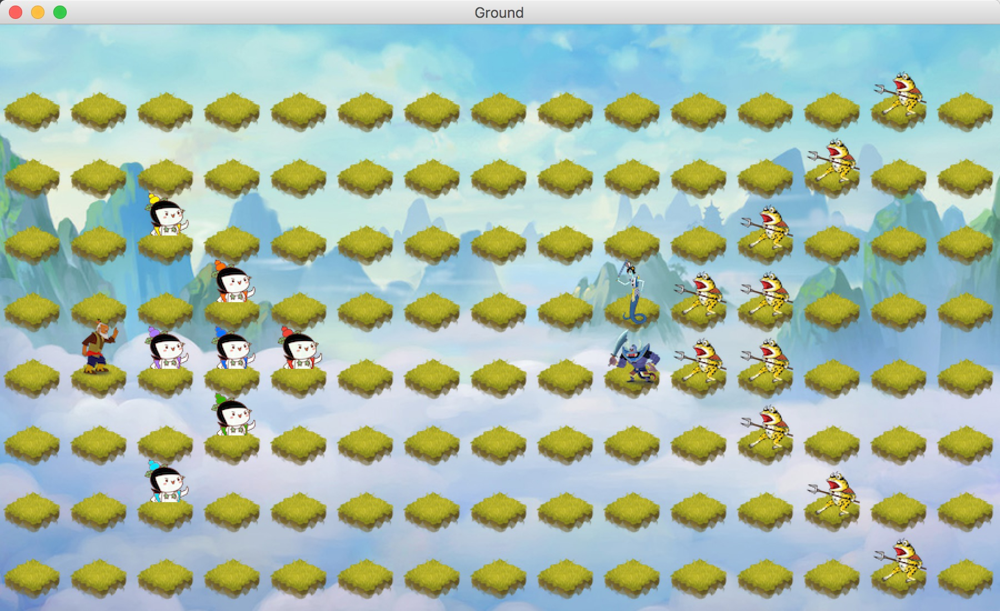

# Calabash-Brothers
葫芦娃大战妖精



## 游戏介绍
本“游戏”是用Java编写的一款葫芦娃大战妖精的小游戏。之所以对游戏打一引号，是因为一切操作都不用玩家进行，玩家只需按下空格，便可以观赏葫芦娃大战妖精。

## 使用说明
使用说明尤其简单。进入游戏后：
* 按下空格，开始游戏，葫芦娃与妖精开始战斗。
* 一方全部死亡后，游戏自动结束，显示 Completed。
* 在游戏未开始或结束后，按下R，可以恢复初始状态。
* 在游戏未开始或结束后，按下L，可以从文件中加载游戏记录并开始回放。（每一局游戏进行结束后，记录会自动存放在目录中的“record.txt“文件中）

## 详细介绍
下面对游戏的开发做一个介绍。游戏使用java语言编写，图形化界面使用的是swing。

### 数据结构介绍
游戏窗口用Ground来抽象，场地用Field来抽象，一切都发生在这个Field中。
游戏采用2D坐标，所有的物体用Thing2D来抽象，结构内有坐标，图片等结构。Thing2D部分内容如下：
```
public class Thing2D {
    protected final int SPACE = 60;
    protected final int w = SPACE*15;
    protected final int h = SPACE*8 + SPACE/2;

    private int x;
    private int y;
    private Image image;
    ...
}
```
游戏地板是一块块草地，用Tile来抽象，继承Thing2D。所有生物用Creature抽象，同样继承了Thing2D。

其中生物再下分两类，好人和坏人，分别用DecentRole和VillainRole来抽象，都是继承了Creature。

好人中有葫芦娃和爷爷，故下面还有两个子类 Huluwa 和 Grandfather。

坏人有蛇精，蝎子精，小喽啰，故有三个子类 Snake， Scorpion， Minion。

### 运行流程介绍
在Field中，拥有一个“上帝”，可以制造生物。上帝在脑海中构造了两方的阵型，于是把它表现了了出来：
```
private String level =
                    ".............m.\n" +
                    "............m..\n" +
                    "..2........m...\n" +
                    "...1.....smm...\n" +
                    ".g650....nmm...\n" +
                    "...3.......m...\n" +
                    "..4.........m..\n" +
                    ".............m."  ;
```
(最终显示结果即为开头的游戏画面截图）

每一个生物都是一个Runnable，拥有Run函数，也就是有独立的思想，能够在场地中进行走动。当上帝按下空格后，就像是给这些生物一个讯号：动起来吧！于是所有生物开始了自己的运动（多线程用ExecutorService实现）：
```
if(key == KeyEvent.VK_SPACE) {

                String fileName = System.getProperty("user.dir") + "/record.txt";
                try {
                    bufferedWriter = new BufferedWriter(new FileWriter(fileName));
                } catch (Exception exception) {
                    System.out.println("Initialize objectOutputStream: " + exception);
                }
                timer = new Timer();
                timer.scheduleAtFixedRate(new RecordTask(getOuter(),  bufferedWriter), 0, 500);
                for(Huluwa huluwa: huluwas)
                    executorService.execute(huluwa);
                executorService.execute(grandFather);
                executorService.execute(snake);
                executorService.execute(scorpion);
                for(Minion minion: minions)
                    executorService.execute(minion);
            }
```
#### 老爷爷
神秘而强大的老爷爷，在游戏中充当指挥的角色。他的主要职责是指挥葫芦娃行动，故他在后方上下移动，指挥战争。
但是专门指挥肯定是不够的啊。若是所有的葫芦娃都不幸死掉的话，老爷爷就只有孤军奋战，上前杀敌了。
故老爷爷的Run代码为：
```
public void run() {
        while (!Thread.interrupted()) {
            if (isAlive && !isInBattle) {
                //当葫芦娃没有全部死亡时，老爷爷在左边指挥战争。若葫芦娃全部死亡，老爷爷孤军奋战，奋勇杀敌。
                ArrayList<Huluwa> huluwaArrayList = field.getHuluwas();
                boolean allDead = true;
                Random random = new Random();
                for(Huluwa huluwa: huluwaArrayList) {
                    if (huluwa.isAlive) {
                        allDead = false;
                        break;
                    }
                }
                if (!allDead) {
                    int flag = random.nextInt(10);
                    if (flag < 5)
                        moveDown();
                    else
                        moveUp();
                }
                else {
                    moveToVillainRole();
                }
```

#### 葫芦娃
作为游戏主角的葫芦娃，是怎么想的呢？ 葫芦娃十分能打，并且好战,故它从一开始，就一直朝着敌人前进。哪里有敌人就往哪里去。但是聪明的葫芦娃并不是茫然前进。在每次前进之前，它会计算所有敌人到它的距离，然后找出距离它距离最小的敌人，并朝向它前进。所以在这种策略下，葫芦娃总能快速的找到敌人。
葫芦娃的Run代码如下：
```
protected void moveToVillainRole() {
        int minDistance = Integer.MAX_VALUE;
        VillainRole nearestEnemy = null;
        if (field.getSnake().isAlive && distanceTo(field.getSnake()) < minDistance) {
            minDistance = distanceTo(field.getSnake());
            nearestEnemy = field.getSnake();
        }
        if (field.getScorpion().isAlive && distanceTo(field.getScorpion()) < minDistance) {
            minDistance = distanceTo(field.getScorpion());
            nearestEnemy = field.getScorpion();
        }
        for(Minion minion: field.getMinions()) {
            if (minion.isAlive && distanceTo(minion) < minDistance) {
                minDistance = distanceTo(minion);
                nearestEnemy = minion;
            }
        }
```

#### 蝎子精， 蛇精
蝎子精和蛇精也比较勇猛，一开局就奋勇前进，朝着葫芦娃大军跑。（故它们一般死的比较快）。

#### 小喽啰
小喽啰数量比较多，但是既然作为小喽啰，它们的智商不太高，在游戏中的行走策略为：
* 从右边一直走到左边，若到头则开始转向右边。往右到头再走到左边...以此循环。

### 回放算法
对于这个游戏的开发，其实我用时最多的倒是这个所谓的“回放”功能。 刚开始以为这个功能比较容易，只需记录Field中所有生物的位置即可。但是我又发现不然，为了使游戏生动，我加入了很多新的状态，例如葫芦娃在战斗时，会换成其他的图片，生物往左和往右走时图片也是不一样的。这样的话，若是像一开始的上帝一样记录整个Field就不行了，这样所有的生物根本不知道它们在什么状态里。
#### 走的弯路
为了实现这个回放，我想了很多很多办法，最后感觉比较可行的是，每隔一定的时间，保存所有生物对象进文件里。
于是开始Google，Java中如何将对象存入文件。

开始我使用了Java自带的ObjectOutputStream这些功能。将所有的对象都Serialize后，开始报错。因为类之间的错综复杂的关系，各种Field，Creature，Huluwa之间有着千丝万缕的联系，所以这个Serialize总是报出异常。最后不得不放弃。

后来我又尝试用Xstream，网上推荐的将对象转换为xml文件信息的一个工具。我直接在TimerTask里，每隔一段时间将整个Field对象保存进来。这样做，理论上的确可行。但是打完一局后，。。record.xml文件竟达到了500M大小，连打开都要耗费半天。兜兜转转，我又不得不放弃这种方法。 或许你会奇怪为什么不直接把Huluwa等生物保存进xml呢？但是每一个生物里都有field这个属性，，所以不管怎样总是要保存field的。

#### 解决办法
最后实在没辙，我决定自己写一个转化函数。因为对于每一个生物，为了回放我们需要的信息并不多，只要： x，y坐标，朝向，是否死亡，是否在攻击中，这些简单的属性即可。而朝向，是否存活这些属性，最终的目的也是找出一个合适的图片。所以最后我对每一个生物抽象出三个关键信息：x，y，图片名。将这三个信息保存起来，最后就可以成功回放了。

所以最后record.txt中的内容大致如下：
```
120 150 yellow-right.png
180 210 orange-right.png
120 270 purple-right.png
180 270 blue-right.png
240 270 red-right.png
180 330 green-right.png
120 390 cyan-right.png
60 270 grandfather-right.png
540 210 snake-left.png
540 270 scorpion-left.png
780 30 minion-left.png
720 90 minion-left.png
```
### 游戏特点
* 较为生动。为了使游戏生动形象，我使用了较多的图片素材。每个生物都有三个个素材图片：向左移动，向右移动，死亡。另外对于主角葫芦娃，更是有第四种状态图片：攻击。 所以运行时会感觉比较生动。
* 记录完整。由于在记录时我记录了所有生物的运行状态，并且每0.5s记录一次。这样回放的时候，能够很精彩的还原出战斗场景，并且所有内容都有保留。

## 结束语
这个小游戏很大的加深了我对Java的了解程度。印象最深的是解决问题时的一些收获。有时候为了解决一个小问题，不得不寻找大量的资料，了解许许多多周边的知识（虽然这些知识都不考...)。
很感谢两位老师的栽培。Java会继续用下去的，谢谢。


